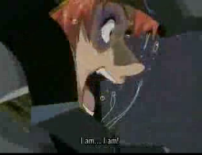

# What is LT？

---

Lightning Talksの略です。

技術にまつわる勉強会やカンファレンスで  
実施されることが多いです。

```
ライトニングトーク（英: Lightning Talks）とは
カンファレンスやフォーラムなどで行われる短いプレゼンテーションのこと。
様々な形式があるが、持ち時間が5分という制約が広く共有されている。

出典 wikipedia
```

---

## 僕は、僕はねっ！



## LT大会がしたいんです！
